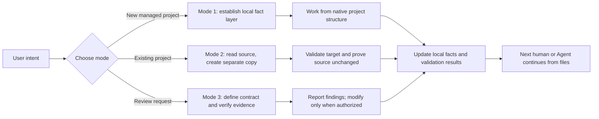

# Project Management Skill

[English](README.md) · [简体中文](README.zh-CN.md) · [Interactive bilingual website](https://liyangbai-hub.github.io/project-management-skill/)

> **Your project should not die in a chat history.**
>
> Keep core project plans and work records in local files—not trapped inside one AI account. Let multiple Agents relay the same work through a standardized project protocol, making the most of different AI products and subscriptions without rebuilding context every time.


## Still explaining the same project every time you switch AI?

Does a new Agent have to rediscover your goals, architecture, and unfinished work? Would an account change make decisions and development history difficult to recover? Are bug fixes hard to trace because plans, deviations, and validation evidence are scattered across conversations?

**Project Management Skill moves durable project memory back where it belongs: inside the project folder.** The next Agent reads the same local facts, verifies important claims against the actual project, and continues from a clear handoff point—even without access to the previous chat.

**[Open the bilingual website](https://liyangbai-hub.github.io/project-management-skill/)** · **[Install now](docs/installation.en.md)** · **[See the three modes](#three-modes)**

## Two core ideas

### 1. Local files are the durable project memory

The project folder—not one provider's chat history—holds the current facts and work trail. The records remain available after a ZIP transfer, Git clone, computer replacement, account change, or Agent switch.

Documentation is navigation, not proof. The skill requires important claims about behavior, completion, dependencies, configuration, and validation to be checked against the actual project.

### 2. Standardized records enable multi-Agent relay

A tool-neutral `AGENTS.md` provides the main working agreement. A short `CLAUDE.md` points Claude Code to it without duplicating the rules. `README.md`, `DEVLOG.md`, and related files give the next Agent a consistent place to learn what the project is, what happened, what is in progress, what comes next, and how claims were validated.

This makes it practical to continue one project across multiple Agents and AI subscriptions. It does **not** bypass provider limits or guarantee that every Agent integration behaves identically.

## Problems it addresses

- Project goals and decisions exist only in a conversation that another Agent cannot access.
- A new Agent repeats discovery work because current status and validation evidence are missing.
- Work plans are silently replaced by later summaries, making deviations and abandoned approaches hard to trace.
- A legacy project needs a clean, standardized handoff copy without changing the original.
- Reviews report plausible issues without proving a concrete failure path.
- Project-management conventions break native frameworks, source layouts, or build systems.
- Installation depends on one author's private path, shell, runtime, or symbolic links.

## Three modes

| Mode | Use it when | Primary outcome |
|---|---|---|
| **Mode 1: Create a managed project** | Starting a long-lived project that needs durable local records | A meaningful fact layer created before substantive implementation, while preserving the project's native layout |
| **Mode 2: Build a standardized copy** | Understanding an existing project and producing a separately located, standardized version | An independently validated target copy plus evidence that the source project remained unchanged |
| **Mode 3: Evidence-based review** | Reviewing code, configuration, data flow, skills, prompts, specifications, or documentation systems | Verified findings with coverage, concrete failure scenarios, attempted disproof, certainty, severity, and authorization boundaries |

The formal behavior is defined only by [`SKILL.md`](SKILL.md) and the four Simplified Chinese files in [`references/`](references/). This README explains the project; it is not a second execution specification. The skill is self-contained and requires no external workflow, plugin, or additional skill.

## Workflow



In text: determine the user's intent and authorization boundary, select the relevant mode, establish or inspect the local fact layer, verify important claims against the project, record actual results, and leave a clear continuation point for the next human or Agent.

## Quick start

1. Install this repository as a Claude Code skill so `SKILL.md` is directly inside the `project-management` skill directory.
2. Start a new Claude Code session if your installed version does not refresh skill discovery automatically.
3. Describe the project-level outcome you want. For example:

```text
Create a managed project for a small offline budgeting app. Keep the framework's native layout and establish local handoff records before implementation.
```

```text
Read the project at <source-project> without modifying it, then create a standardized, independently usable copy at <target-project>.
```

```text
Review this configuration system read-only. Report only issues supported by a concrete failure scenario and evidence; do not modify anything.
```

4. Review the proposed paths, scope, and authorization boundary before any destructive or outward-facing action.
5. After work completes, inspect the produced files and validation evidence rather than relying on an Agent's completion claim alone.

## Install for Claude Code

Personal installation:

```text
~/.claude/skills/project-management/
```

Windows equivalent:

```text
$HOME\.claude\skills\project-management\
```

Project-level installation:

```text
<project-root>/.claude/skills/project-management/
```

The installed directory must directly contain `SKILL.md` and `references/`. Avoid an extra repository nesting level such as `project-management/project-management-skill/SKILL.md`.

See the complete guides:

- [Installation in English](docs/installation.en.md)
- [安装说明（简体中文）](docs/installation.zh-CN.md)
- [Troubleshooting](docs/troubleshooting.md)
- [Maintenance checks](docs/maintenance-checks.md)

Git is optional. ZIP download and manual copying are supported. The core behavior does not require Git, GitHub CLI, Python, Node.js, Bash, PowerShell, `rsync`, `robocopy`, or symbolic links.

## Codex and other Agents

Managed projects use `AGENTS.md` as the tool-neutral handoff entry. Codex skill discovery and installation locations may change by version, so this repository does not guess a personal or project-level Codex skill path. Check the official [OpenAI Codex Skills documentation](https://developers.openai.com/codex/skills) for the installed version.

If an adapter is needed, prefer a thin entry layer that points to this repository instead of copying the full behavioral specification. Full Codex real-environment validation is still pending.

## Example scenarios

The repository includes compact examples and synthetic behavioral fixtures for:

- a new code project that keeps its native source layout and records a file-only handoff;
- an independently located standardized-copy delivery structure;
- a read-only evidence-based audit with a concrete, reproducible failure path;
- legacy source and audit fixtures referenced by nine evaluation scenarios in `evals/evals.json`;
- a non-trigger scenario that verifies small explanations and spelling fixes do not invoke the full workflow.

These examples validate file structure and expected behavior boundaries. They are not proof that every Agent, framework, operating system edge case, or end-to-end workflow has been tested.

## Generated project fact layer

A managed project can use the following files as needed:

```text
<project-root>/
├── AGENTS.md              # Tool-neutral working agreement and handoff entry
├── CLAUDE.md              # Short pointer to AGENTS.md for Claude Code
├── README.md              # Current project map and rationale
├── DEVLOG.md              # Work units, decisions, results, deviations, and current status
├── CHANGELOG.md           # Implemented user-visible changes only
├── requirements/
│   └── INDEX.md           # Input-material assessment and absorption locations, when needed
└── AUDIT.md               # Evidence-based review history, created after the first review
```

This is a fact layer, not a forced source layout. Application code, tests, assets, configuration, and documentation remain where the native framework and toolchain expect them. The skill does not force engineering projects into a `技术/` directory.

## Data, safety, and authorization boundaries

- Secrets, tokens, private keys, real `.env` values, personal data, and private records are excluded from public documentation and standardized copies by default.
- Mode 2 keeps the source project read-only. It does not move, rename, delete, reduce, reorganize, or overwrite the source.
- Source and target paths must be independent after resolving symbolic links, Windows junctions, and reparse points.
- A non-empty target stops by default unless the user explicitly approves a specific merge or overwrite strategy.
- Deletion, overwrite, bulk rename, irreversible migration, and other hard-to-reverse actions require explicit authorization for the exact scope.
- A read-only review remains read-only regardless of finding severity.
- Local Git permission does not authorize creating a remote repository, pushing, changing remote branches, opening a pull request, creating a Release, or publishing externally.
- Failed, skipped, environment-limited, or uncertain validation must not be presented as passed.

## Compatibility and validation status

| Environment | Current status |
|---|---|
| **Windows** | Representative filesystem, path-safety, encoding, and installation-structure checks passed on Windows 11 with PowerShell 5.1; dynamic skill discovery and full three-mode end-to-end execution were not run |
| **macOS** | Representative filesystem, symlink-path safety, encoding, and installation-structure checks passed on macOS 26.5.2 (arm64); dynamic skill discovery and full three-mode end-to-end execution were not run |
| **Claude Code** | Direct installation structure is documented and statically checked; complete behavioral evaluation in a fresh isolated session remains pending |
| **OpenAI Codex** | `AGENTS.md` handoff and conservative integration are designed; real-environment skill discovery and workflow validation are pending |
| **Git / ZIP / manual copy** | Supported as installation approaches by design; each release should state what was actually tested |

Detailed evidence: [Windows validation](docs/validation-windows.md) · [macOS validation](docs/validation-macos.md).

The repository is **pre-release** because dynamic Agent discovery and full end-to-end scenarios remain incomplete. The repository owner and links are configured for [`liyangbai-hub/project-management-skill`](https://github.com/liyangbai-hub/project-management-skill).

## FAQ

### Does this store the entire project inside Markdown files?

No. The fact layer records the project map, status, decisions, work history, and validation evidence. The actual source code, configuration, assets, and data stay in their normal project locations.

### Can a new Agent completely understand a project by reading the files?

The files greatly reduce handoff cost, but they are not proof of runtime behavior. A new Agent should use them to navigate, then verify important claims against actual code, configuration, dependencies, and applicable commands.

### Does Mode 2 migrate or clean up the original project?

No. It reads the source project without modifying it and creates a separate target copy. The process records evidence before and after creation to demonstrate that the source did not change.

### Does Mode 3 automatically fix every serious issue?

No. Review certainty and severity do not grant modification authority. A read-only request produces a report only. Remediation requires authorization, its own work record, implementation, and regression verification.

### Is Git required?

No. Git is recommended when useful, but the fact layer and core workflows work with ordinary local files. The skill never initializes, commits, or publishes by default.

### Can this maximize multiple AI subscriptions?

It can reduce repeated context reconstruction by keeping shared project facts locally, making it easier to hand work between Agents and services. It does not circumvent subscription terms, quotas, provider limits, or access controls.

### Why is the formal specification only in Simplified Chinese?

Maintaining one formal source reduces behavioral drift. `SKILL.md` and `references/*.md` are the formal source; English and Chinese landing pages explain the same project without becoming separate rule sets.

## Contributing

Read [`AGENTS.md`](AGENTS.md) and [`CONTRIBUTING.md`](CONTRIBUTING.md) before proposing changes, then run the applicable checks in [`docs/maintenance-checks.md`](docs/maintenance-checks.md). Contributions should preserve native project layouts, portability, evidence quality, privacy, and explicit authorization boundaries. Compatibility claims must name what was actually tested.

The repository is self-contained: contributing requires no external workflow, plugin, or additional skill.

## License

The repository uses the MIT License. Copyright © 2026 `liyangbai-hub`. See [`LICENSE`](LICENSE).
