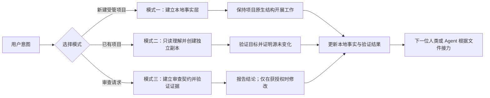

# Project Management Skill（项目管理技能）

[English](README.md) · [简体中文](README.zh-CN.md) · [中英原地切换网页](https://liyangbai-hub.github.io/project-management-skill/)

> **你的项目，不该死在聊天记录里。**
>
> 把项目核心规划以及工作事项留在本地文件夹，而不是 AI 的聊天记录。让多个 Agent 按照标准化项目规范接力工作，最大化使用多家订阅额度，不必每次换 AI 都重新解释整个项目。


## 你是否还在为切换多个 AI 后无法连续工作而苦恼？

每换一个 Agent，就要重新解释项目目标、架构和未完成事项？担心账号变化后，重要决定和开发记录无处追溯？修 Bug 时，又因为计划、偏差和验证证据散落在聊天里而找不到来龙去脉？

**Project Management Skill 把项目记忆放回它真正应该存在的地方：项目文件夹。** 下一位 Agent 从同一组本地事实出发，回到实际项目核验关键结论，并从清晰的接力点继续工作——即使完全看不到上一段聊天。

**[打开中英双语网页](https://liyangbai-hub.github.io/project-management-skill/)** · **[立即安装](docs/installation.zh-CN.md)** · **[查看三种模式](#三种模式)**

## 两个核心理念

### 1. 本地文件才是可持续的项目记忆

项目文件夹，而不是某一家 AI 的聊天记录，保存项目的当前事实和工作轨迹。无论通过 ZIP、Git clone 迁移到新电脑，还是更换账号、产品或 Agent，这些记录都能随项目一起保留。

但文档只是导航，不是运行事实的证明。技能要求涉及行为、完成度、依赖、配置和验证状态的关键结论回到实际项目中核验，不能因为 README 写了“已完成”就直接采信。

### 2. 标准化记录让多个 Agent 接力

工具中立的 `AGENTS.md` 是主要工作协议；简短的 `CLAUDE.md` 把 Claude Code 指向它，避免维护两套入口规则。`README.md`、`DEVLOG.md` 等文件为下一位 Agent 提供稳定位置，用于了解项目是什么、已经做了什么、正在做什么、下一步是什么，以及结论如何得到验证。

这样可以让同一个项目在不同 Agent、AI 产品、账号和订阅之间延续，减少重复理解项目所消耗的上下文与额度。它**不会**绕过平台限制、订阅条款、配额或访问控制，也不承诺所有 Agent 的集成方式完全一致。

## 它解决什么问题

- 项目目标和关键决定只存在于另一位 Agent 看不到的聊天记录中。
- 新 Agent 因缺少当前状态和验证证据，不得不重复理解整个项目。
- 后来的总结覆盖了原计划，导致偏差、放弃方案和真实历史无法追溯。
- 希望把旧项目整理成可接力的规范版本，但不能破坏或改动原项目。
- 审查报告列出许多“看起来可能有问题”的项目，却没有具体失败链和证据。
- 项目管理规范强行改变框架原生目录、源码布局或构建系统。
- 安装依赖作者个人路径、单一脚本环境或跨平台不稳定的符号链接。

## 三种模式

| 模式 | 适用场景 | 主要产物 |
|---|---|---|
| **模式一：创建受管项目** | 新建一个需要长期维护和接力的项目 | 在实质实施前建立有内容的本地事实层，同时保留项目原生布局 |
| **模式二：标准化副本重构** | 理解已有项目，并在另一位置制作规范版本 | 独立验证的目标副本，以及证明源项目没有变化的证据 |
| **模式三：证据化审查** | 审查代码、配置、数据流程、技能、提示词、规范或文档系统 | 包含覆盖范围、具体失败场景、主动反证、确定性、严重性和授权边界的审查结果 |

正式行为仅由 [`SKILL.md`](SKILL.md) 和 [`references/`](references/) 中的四份简体中文文件定义。本 README 负责介绍项目，不是第二套执行规范。技能自足，不依赖任何外部工作流、插件或额外技能。

## 工作流程



文字说明：先识别用户意图和授权边界，再选择模式；建立或读取本地事实层；用实际项目核验关键结论；记录真实结果；最后给下一位人类或 Agent 留下明确、可验证的接力起点。

## 快速开始

1. 把本仓库安装为 Claude Code 技能，确保 `SKILL.md` 直接位于 `project-management` 技能目录中。
2. 如果当前 Claude Code 版本不会自动刷新技能发现，请重新打开一个会话。
3. 描述你需要的项目级结果，例如：

```text
为一个小型离线预算应用创建受管项目。保留框架原生目录，并在开始实现前建立本地接力记录。
```

```text
只读理解 <source-project>，不要修改原项目，然后在 <target-project> 创建一个独立、可用的标准化副本。
```

```text
只读审查这个配置系统。只报告具有具体失败场景和证据的问题，不要修改任何文件。
```

4. 在涉及破坏性或外部操作前，核对路径、范围和授权边界。
5. 工作完成后，检查实际生成的文件和验证证据，不要只相信 Agent 的“已完成”自述。

## 为 Claude Code 安装

个人级安装：

```text
~/.claude/skills/project-management/
```

Windows 等价路径：

```text
$HOME\.claude\skills\project-management\
```

项目级安装：

```text
<project-root>/.claude/skills/project-management/
```

安装目录必须直接包含 `SKILL.md` 和 `references/`。避免出现 `project-management/project-management-skill/SKILL.md` 这样的额外仓库嵌套层级。

完整说明：

- [安装说明（简体中文）](docs/installation.zh-CN.md)
- [Installation in English](docs/installation.en.md)
- [故障排查](docs/troubleshooting.md)
- [维护检查清单](docs/maintenance-checks.md)

Git 是可选工具，也支持 ZIP 下载和手工复制。核心行为不依赖 Git、GitHub CLI、Python、Node.js、Bash、PowerShell、`rsync`、`robocopy` 或符号链接。

## Codex 与其他 Agent

受管项目以 `AGENTS.md` 作为工具中立的接力入口。Codex 的技能发现和安装位置可能随版本变化，因此本仓库不猜测个人级或项目级 Codex 技能路径。请按当前安装版本查看 OpenAI 官方 [Codex Skills 文档](https://developers.openai.com/codex/skills)。

确需适配层时，优先建立指向本仓库的薄入口，不要复制整套正式行为规范。目前尚未完成 Codex 真实环境的完整验证。

## 示例场景

仓库已经包含精简示例和合成行为 fixture，覆盖：

- 保持原生源码布局、可仅凭文件完成接力的新代码项目；
- 位于独立路径的标准化副本交付结构；
- 具有具体可复现失败链的只读证据化审查；
- 被 `evals/evals.json` 中九个评测场景引用的旧项目和审查 fixture；
- 确认普通解释和拼写修正不会启动完整流程的不触发场景。

这些示例用于验证文件结构和预期行为边界，不能证明所有 Agent、框架、操作系统边缘情况或端到端工作流都已经实测。

## 生成的项目事实层

受管项目可以按实际需要使用以下文件：

```text
<project-root>/
├── AGENTS.md              # 工具中立的工作协议与接力入口正本
├── CLAUDE.md              # Claude Code 指向 AGENTS.md 的简短入口桩
├── README.md              # 当前项目地图与设计理由
├── DEVLOG.md              # 工作单元、决策、结果、偏差和当前状态
├── CHANGELOG.md           # 仅记录已经落地的用户可见变化
├── requirements/
│   └── INDEX.md           # 有输入材料时记录评估状态和吸收位置
└── AUDIT.md               # 首次证据化审查后建立的审查历史
```

这是项目事实层，不是强制源码目录。代码、测试、资源、配置和文档继续放在框架与工具链原本要求的位置。技能不会强迫工程项目把代码移入 `技术/`。

## 数据、安全和授权边界

- 凭据、令牌、私钥、真实 `.env` 值、个人信息和私有记录默认不进入公开文档或标准化副本。
- 模式二始终保持源项目只读，不移动、重命名、删除、删减、重组或覆盖源项目。
- 解析符号链接、Windows 联接点和重解析点后，源路径和目标路径仍必须相互独立。
- 非空目标默认停止，只有用户明确批准具体合并或覆盖策略后才能继续。
- 删除、覆盖、批量重命名、不可逆迁移和其他难以恢复的操作，需要用户对准确范围作出明确授权。
- 只读审查始终保持只读，问题严重性不构成修改授权。
- 本地 Git 授权不等于获准创建远程仓库、push、修改远程分支、创建 PR、Release 或对外发布。
- 验证失败、未执行、环境受限或结果不确定时，不得写成通过。

## 兼容性与验证状态

| 环境 | 当前状态 |
|---|---|
| **Windows** | 已在 Windows 11 + PowerShell 5.1 完成代表性文件系统、路径安全、编码和安装结构验证；动态技能发现与三个模式的完整端到端执行未运行 |
| **macOS** | 已在 macOS 26.5.2（arm64）完成代表性文件系统、符号链接路径安全、编码和安装结构验证；动态技能发现与三个模式的完整端到端执行未运行 |
| **Claude Code** | 已记录并静态检查直接安装结构；新隔离会话中的完整行为评测仍待完成 |
| **OpenAI Codex** | 已设计 `AGENTS.md` 接力和保守适配方式；真实环境下的技能发现与工作流验证待完成 |
| **Git / ZIP / 手工复制** | 作为安装方式得到设计支持；每个版本仍应如实说明实际执行过的测试 |

详细证据：[Windows 验证](docs/validation-windows.md) · [macOS 验证](docs/validation-macos.md)。

仓库仍处于**预发布**状态，因为动态 Agent 发现和完整端到端场景尚未全部完成。仓库所有者和链接已经配置为 [`liyangbai-hub/project-management-skill`](https://github.com/liyangbai-hub/project-management-skill)。

## 常见问题

### 是否要把整个项目都写进 Markdown？

不需要。事实层记录项目地图、当前状态、决策、工作历史和验证证据。实际代码、配置、资源和数据仍保留在正常项目位置。

### 新 Agent 只读这些文件就能完全理解项目吗？

这些文件能够显著降低接力成本，但不能单独证明运行行为。新 Agent 应把它们作为导航，再检查实际代码、配置、依赖和适用命令，核验本轮依赖的关键事实。

### 模式二会迁移或清理原项目吗？

不会。模式二只读理解源项目，并在另一独立路径创建目标副本。流程通过创建前后的证据证明源项目没有变化。

### 模式三会自动修复所有严重问题吗？

不会。审查结论的确定性和严重性都不等于修改授权。只读请求只提供报告；修复必须在获得授权后单独建立工作记录、实施并完成回归验证。

### 必须使用 Git 吗？

不必须。Git 在适合时值得推荐，但事实层和核心流程只依赖普通本地文件。技能不会默认初始化 Git、创建 commit 或进行发布。

### 是否真的能最大化使用多个 AI 订阅？

标准化本地事实能够减少不同 Agent 重复理解项目所消耗的上下文，让工作更容易在多个产品和订阅间接力。但它不会绕过订阅条款、配额、平台限制或访问控制。

### 为什么正式行为规范只使用简体中文？

维护一个正式行为真源可以降低中英文双规范产生版本漂移的风险。`SKILL.md` 和 `references/*.md` 是正式规范；中英文首页只负责解释项目和使用入口。

## 贡献

提交修改前请阅读 [`AGENTS.md`](AGENTS.md) 和 [`CONTRIBUTING.md`](CONTRIBUTING.md)，并执行 [`docs/maintenance-checks.md`](docs/maintenance-checks.md) 中适用的检查。贡献应保持项目原生布局、跨平台可移植性、证据质量、隐私保护和明确授权边界；兼容性声明必须说明实际测试了什么。

仓库自足：参与贡献不需要任何外部工作流、插件或额外技能。

## 许可证

本仓库采用 MIT 许可证，版权归属为 © 2026 `liyangbai-hub`。详见 [`LICENSE`](LICENSE)。
