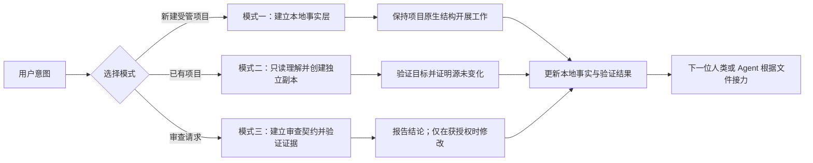

<div align="center">

# Project Management Skill

### 让项目记忆留在项目里，而不是困在一次对话里。

把目标、决策、进度与验证证据沉淀为项目本地事实。<br>
让 Claude Code、Codex 与其他 Agent 在看不到上一段聊天时，依然能找到可信的接力起点。

<p>
  <a href="README.md">English</a> ·
  <strong>简体中文</strong>
</p>

<p>
  <a href="#兼容性与验证状态"></a>
  <a href="LICENSE"></a>
  <a href="docs/installation.zh-CN.md"></a>
  <a href="docs/installation.zh-CN.md#codex-与其他-agent"></a>
</p>

<p>
  <a href="docs/validation-windows.md"></a>
  <a href="docs/validation-macos.md"></a>
</p>

### [⚡ 立即安装](#立即安装) · [🧭 查看三种模式](#三种模式)

</div>

---

## 你的 AI 会换，但项目上下文不该重来

| 🔁 换一个 Agent，又要从头解释 | 🧠 聊天消失，项目历史也消失 | 🔍 修 Bug 找不到来龙去脉 |
|---|---|---|
| 目标、架构和未完成事项每次重新讲一遍 | 计划、决策与偏差散落在不同账号和会话里 | 审查、修复和验证证据无法串成一条线 |

**Project Management Skill 把项目记忆放回它真正属于的地方：项目文件夹。**

下一位 Agent 从同一组本地事实出发，先用文档定位，再回到实际代码、配置与命令核验关键结论。即使它完全看不到上一段聊天，也能知道项目是什么、做到哪里、下一步是什么。

> [!IMPORTANT]
> 本技能减少的是重复理解和交接成本。它不会绕过任何平台的订阅条款、配额、访问控制或安全边界，也不承诺所有 Agent 的集成行为完全一致。

## 两个核心理念

> ### 01 · 本地文件才是可持续的项目记忆
>
> 项目文件夹保存当前事实和工作轨迹。通过 ZIP、Git clone 换电脑，或者更换账号、产品与 Agent 时，目标、状态、计划、决策和验证证据依然随项目存在。

> ### 02 · 标准化记录让不同 Agent 真正接得上
>
> `AGENTS.md` 提供工具中立的工作入口，`CLAUDE.md` 把 Claude Code 指向同一份协议，`README.md`、`DEVLOG.md`、`CHANGELOG.md` 和 `AUDIT.md` 分别承载当前地图、工作时间线、已落地变化与审查证据。

文档负责导航，而不是代替事实核验。README 写着“已完成”，不等于功能真的可运行；技能会要求 Agent 查看实际代码、配置、依赖和验证结果。

## 立即安装

安装目录必须**直接包含 `SKILL.md` 和 `references/`**，不要多套一层仓库目录。

### Claude Code：个人级

```bash
git clone https://github.com/liyangbai-hub/project-management-skill.git \
  "$HOME/.claude/skills/project-management"
```

Claude Code 也支持项目级目录 `<project-root>/.claude/skills/project-management/`。已被发现的技能目录发生增删改时通常会在当前会话实时生效；如果会话启动时顶层 skills 目录不存在、本次才首次创建，而技能没有出现，请重新打开会话。

### OpenAI Codex：个人级

```bash
git clone https://github.com/liyangbai-hub/project-management-skill.git \
  "$HOME/.agents/skills/project-management"
```

Codex 当前还支持仓库级 `<project-root>/.agents/skills/project-management/` 与管理员级 `/etc/codex/skills/project-management/`。部分现有版本或较早安装仍可能使用 `~/.codex/skills/project-management/`；它是兼容位置，不是当前首选路径。

> [!CAUTION]
> 如果目标目录已经存在，先检查是否有本地自定义内容，再选择备份、比较或明确的更新策略；不要直接覆盖。

没有 Git 也可以通过 ZIP 或手工复制安装。项目级安装、Windows 命令、更新、卸载与验证步骤见：

- **[安装说明（简体中文）](docs/installation.zh-CN.md)**
- [Installation in English](docs/installation.en.md)
- [故障排查](docs/troubleshooting.md)

Git、GitHub CLI、Python、Node.js、Bash、PowerShell、`rsync`、`robocopy` 和符号链接都不是技能核心运行依赖。

## 三种模式

| 模式 | 什么时候用 | 你会得到什么 |
|---|---|---|
| **01 · 创建受管项目** | 新建一个需要长期维护和多 Agent 接力的项目 | 在实质实施前建立有内容的本地事实层，同时保留框架原生布局 |
| **02 · 标准化副本重构** | 理解已有项目，但不能破坏或改动原项目 | 在独立路径生成可用、可验证的规范副本，并提供源项目未变化的证据 |
| **03 · 证据化审查** | 审查代码、配置、数据流、技能、提示词、规范或文档系统 | 带覆盖范围、具体失败场景、主动反证、确定性、严重性与授权边界的审查结果 |

正式行为仅由 [`SKILL.md`](SKILL.md) 和 [`references/`](references/) 中的四份简体中文文件定义。本 README 是项目介绍与使用入口，不是第二套执行规范。

## 工作流程



文字版：识别用户意图和授权边界 → 选择模式 → 建立或读取本地事实层 → 用实际项目核验关键结论 → 记录真实结果 → 留下清晰、可验证的接力起点。

## 从一句话开始

安装后，直接描述你需要的项目级结果：

```text
为一个小型离线预算应用创建受管项目。保留框架原生目录，并在开始实现前建立本地接力记录。
```

```text
只读理解 <source-project>，不要修改原项目，然后在 <target-project> 创建一个独立、可用的标准化副本。
```

```text
只读审查这个配置系统。只报告具有具体失败场景和证据的问题，不要修改任何文件。
```

涉及删除、覆盖、批量重命名、远程发布等破坏性或外部操作时，Agent 必须先核对准确路径、范围和授权边界。工作完成后，以实际文件和验证证据为准，而不是只相信“已完成”的自述。

## 仓库里已经有什么

仓库包含精简示例和合成行为 fixture，覆盖：

- 保持原生源码布局、可仅凭文件完成接力的新代码项目；
- 位于独立路径的标准化副本交付结构；
- 具有具体可复现失败链的只读证据化审查；
- `evals/evals.json` 中九个评测场景引用的旧项目与审查 fixture；
- 普通解释和拼写修正不应启动完整流程的非触发场景。

这些材料验证的是文件结构和预期行为边界，不代表所有 Agent、框架、操作系统边缘情况或端到端工作流都已经实测。

## 项目事实层长什么样

```text
<project-root>/
├── AGENTS.md              # 工具中立的工作协议与接力入口正本
├── CLAUDE.md              # Claude Code 指向 AGENTS.md 的简短入口桩
├── README.md              # 当前项目地图与设计理由
├── DEVLOG.md              # 工作单元、决策、结果、偏差和当前状态
├── CHANGELOG.md           # 仅记录已经落地的用户可见变化
├── requirements/
│   └── INDEX.md           # 有输入材料时记录评估状态和吸收位置
└── AUDIT.md               # 首次证据化审查后建立的审查历史
```

这是事实层，不是强制源码目录。代码、测试、资源、配置和文档继续留在框架与工具链原本要求的位置；技能不会强迫工程项目把代码移入 `技术/`。

## 数据、安全和授权边界

- 凭据、令牌、私钥、真实 `.env` 值、个人信息和私有记录默认不进入公开文档或标准化副本。
- 模式二始终保持源项目只读，不移动、重命名、删除、删减、重组或覆盖源项目。
- 解析符号链接、Windows 联接点和重解析点后，源路径与目标路径仍必须独立。
- 非空目标默认停止，只有用户明确批准具体合并或覆盖策略后才能继续。
- 删除、覆盖、批量重命名和不可逆迁移，需要用户对准确范围作出明确授权。
- 只读审查始终只读；问题严重性不构成修改授权。
- 本地 Git 授权不等于获准创建远程仓库、push、修改远程分支、创建 PR、Release 或对外发布。
- 验证失败、未执行、环境受限或结果不确定时，不得描述为通过。

## 兼容性与验证状态

| 环境 | 当前状态 |
|---|---|
| **Windows** | 已在 Windows 11 + PowerShell 5.1 完成代表性文件系统、路径安全、编码和安装结构验证；动态技能发现与三个模式的完整端到端执行未运行 |
| **macOS** | 已在 macOS 26.5.2（arm64）完成代表性文件系统、符号链接路径安全、编码和安装结构验证；动态技能发现与三个模式的完整端到端执行未运行 |
| **Claude Code** | 已记录并静态检查直接安装结构；新隔离会话中的完整行为评测仍待完成 |
| **OpenAI Codex** | 已按当前官方目录修正安装说明；真实环境下的技能发现与工作流验证待完成 |
| **Git / ZIP / 手工复制** | 作为安装方式得到设计支持；每个版本仍应如实说明实际执行过的测试 |

详细证据：[Windows 验证](docs/validation-windows.md) · [macOS 验证](docs/validation-macos.md)。

仓库仍处于**预发布**状态，因为动态 Agent 发现和完整端到端场景尚未全部完成。

## 常见问题

<details>
<summary><strong>是否要把整个项目都写进 Markdown？</strong></summary>

不需要。事实层记录项目地图、当前状态、决策、工作历史和验证证据；实际代码、配置、资源和数据仍保留在正常位置。

</details>

<details>
<summary><strong>新 Agent 只读这些文件就能完全理解项目吗？</strong></summary>

这些文件能够显著降低接力成本，但不能单独证明运行行为。新 Agent 应把它们作为导航，再检查实际代码、配置、依赖和适用命令。

</details>

<details>
<summary><strong>模式二会迁移或清理原项目吗？</strong></summary>

不会。模式二只读理解源项目，在另一独立路径创建目标副本，并通过创建前后的证据证明源项目没有变化。

</details>

<details>
<summary><strong>模式三会自动修复所有严重问题吗？</strong></summary>

不会。确定性和严重性都不等于修改授权。只读请求只提供报告；修复必须在获得授权后单独记录、实施并完成回归验证。

</details>

<details>
<summary><strong>必须使用 Git 吗？</strong></summary>

不必须。Git 在适合时值得推荐，但事实层和核心流程只依赖普通本地文件。技能不会默认初始化 Git、创建 commit 或进行发布。

</details>

<details>
<summary><strong>它能绕过限制，最大化使用多个 AI 订阅吗？</strong></summary>

它能减少不同 Agent 重复理解项目所消耗的上下文，让工作更容易在多个产品与订阅间接力；但不会绕过订阅条款、配额、平台限制或访问控制。

</details>

<details>
<summary><strong>为什么正式行为规范只使用简体中文？</strong></summary>

维护一个正式行为真源可以降低中英文双规范的版本漂移风险。`SKILL.md` 和 `references/*.md` 是正式规范；中英文首页负责解释项目和提供使用入口。

</details>

## 贡献

提交修改前请阅读 [`AGENTS.md`](AGENTS.md) 和 [`CONTRIBUTING.md`](CONTRIBUTING.md)，并执行 [`docs/maintenance-checks.md`](docs/maintenance-checks.md) 中适用的检查。贡献应保持项目原生布局、跨平台可移植性、证据质量、隐私保护和明确授权边界。

## 许可证

本仓库采用 [MIT License](LICENSE)，版权 © 2026 `liyangbai-hub`。
